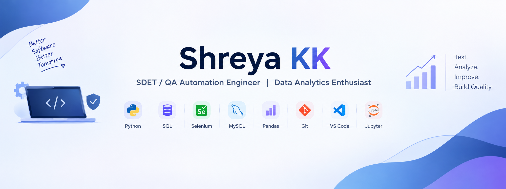

  

<h1 align="center">Hi 👋, I'm Shreya KK</h1>

<h3 align="center">
SDET / QA Automation Engineer | Data Analytics Enthusiast
</h3>

  <a href="mailto:kkshreyasis@gmail.com">📧 Email</a> •
  <a href="https://linkedin.com/in/shreyakk24">💼 LinkedIn</a> •
  <a href="https://github.com/kkshreya">🐙 GitHub</a>

---

## 👩‍💻 About Me

I'm a Computer Science & Engineering undergraduate interested in
**Software Testing, QA Automation, Data Analytics, and Software Quality**.

I enjoy identifying defects, validating application behavior, working
with structured data, writing SQL queries, and using Python for data
analysis and validation.

- 🎓 B.E. Computer Science & Engineering — 2023–2027
- 🧪 Interested in SDET, QA Automation & Software Testing
- 📊 Building practical skills in Data Analytics
- 🐍 Working with Python, Pandas, NumPy and SQL
- 🗄️ Familiar with MySQL and database validation
- 🔧 Comfortable with Git, GitHub and Jupyter Notebook

---

## 🛠️ Technical Skills

**Languages:**  
Python • C • SQL

**QA & Testing:**  
Manual Testing • Test Case Design • Functional Testing •
Exploratory Testing • Data Validation • Defect Identification •
Root-Cause Debugging

**Data Analytics:**  
Pandas • NumPy • Data Cleaning • EDA • Data Validation •
Data Visualization • Excel

**Database:**  
MySQL • SQL Queries • Data Integrity Validation

**Web & Tools:**  
HTML • CSS • Git • GitHub • Jupyter Notebook • VS Code

---

## 🚀 Featured Projects

### 📊 Sales Data Analysis

Analyzed sales data using **SQL and Python**, validating revenue
figures and identifying anomalies in customer records.

**Skills:** SQL • Python • Pandas • Data Validation

---

### 🎓 Student Performance Analysis

Performed data cleaning and validation on student data before
analysis, followed by exploratory analysis and visualization.

**Skills:** Python • Pandas • Data Cleaning • EDA

---

### 🧑‍💻 COGNIFY – Smart Student Management Portal

Tested a student management application involving **face-recognition
attendance and MySQL database integration**.

**Focus:** Functional Testing • Database Testing • Data Validation •
Edge-Case Testing

---

### 🔐 Secure Password Generator

Developed and tested a Python application against defined security
requirements, including password-strength and edge-case validation.

**Technology:** Python

---

## 📈 Data Analytics Portfolio

My GitHub projects include practical work in:

- Data Cleaning & Preprocessing
- Exploratory Data Analysis
- SQL Data Analysis
- Sales Trend Analysis
- Sales Performance Dashboards
- HR Analytics
- Global CO₂ Emissions Analysis
- Data Visualization & Storytelling

---

## 💼 Internship Experience

**Web Development Intern — Skills Craft**

Worked on front-end features and manually tested functionality across
browsers, identifying UI and functional issues.

**Web Development Intern — Zallima Development**

Verified application features against requirements and performed
functional checks during development cycles.

:contentReference[oaicite:2]{index=2}

---

## 🏆 Achievements

- 🥇 1st Place — IEEE College Technical Event
- 💡 Smart India Hackathon 2024 Participant
- 💡 Smart India Hackathon 2025 Participant
- 🚀 Participant in multiple inter-college hackathons

:contentReference[oaicite:3]{index=3}

---

## 📜 Certifications

- 🐍 Python for Data Science — NPTEL
- 🐍 Python 101 for Data Science — IBM Developer Skills Network
- 💻 C Programming — MICE
- 🌐 Web Development — MICE

:contentReference[oaicite:4]{index=4}

---

## 🎯 Career Interests

🧪 SDET / QA Automation  
🔍 Software Testing  
🛡️ Quality Assurance  
🤖 Test Automation  
📊 Data Analytics  
🗄️ Database & SQL Testing

---

## 📊 GitHub Stats

  
  

---

## 🤝 Let's Connect

📧 Email:kkshreyasis@gmail.com  
💼 LinkedIn:https://linkedin.com/in/shreyakk24
🐙 GitHub:https://github.com/kkshreya
---

  <b>Test. Analyze. Improve. Build Quality.</b>

